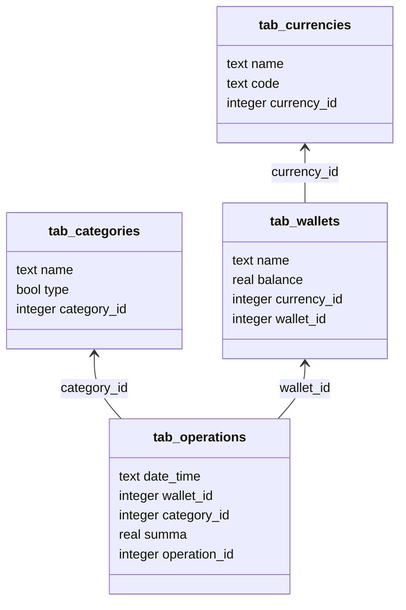

# Диаграмма таблиц БД

```mermaid
classDiagram
direction BT
class tab_categories {
   text name
   bool type
   integer category_id
}
class tab_currencies {
   text name
   text code
   integer currency_id
}
class tab_operations {
   text date_time
   integer wallet_id
   integer category_id
   real summa
   integer operation_id
}
class tab_wallets {
   text name
   real balance
   integer currency_id
   integer wallet_id
}

tab_operations  -->  tab_categories : category_id
tab_operations  -->  tab_wallets : wallet_id
tab_wallets  -->  tab_currencies : currency_id
```
