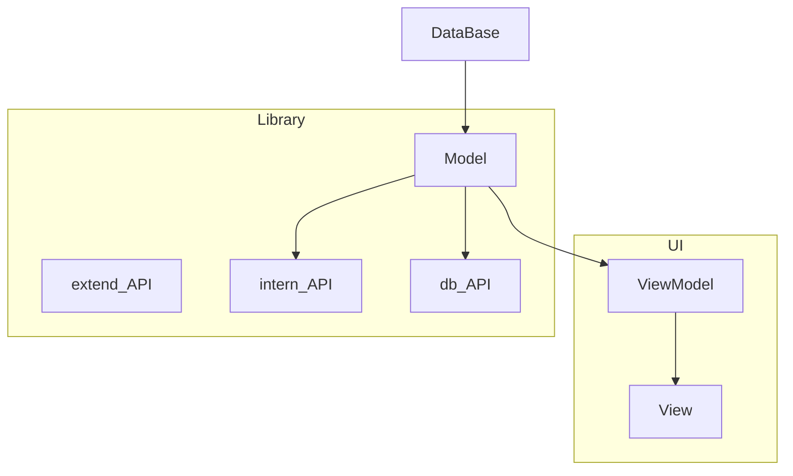
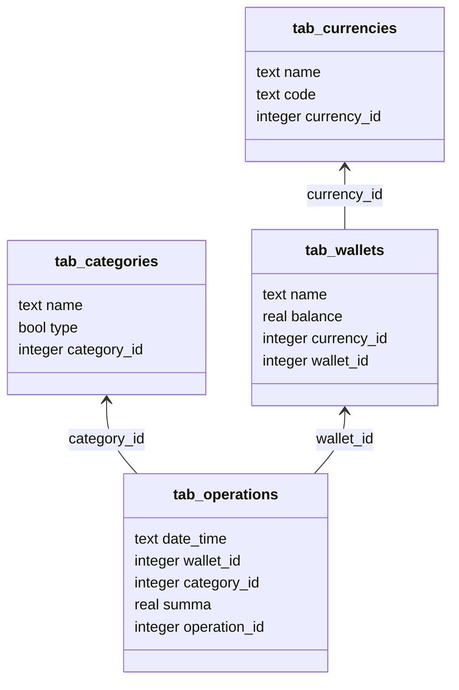
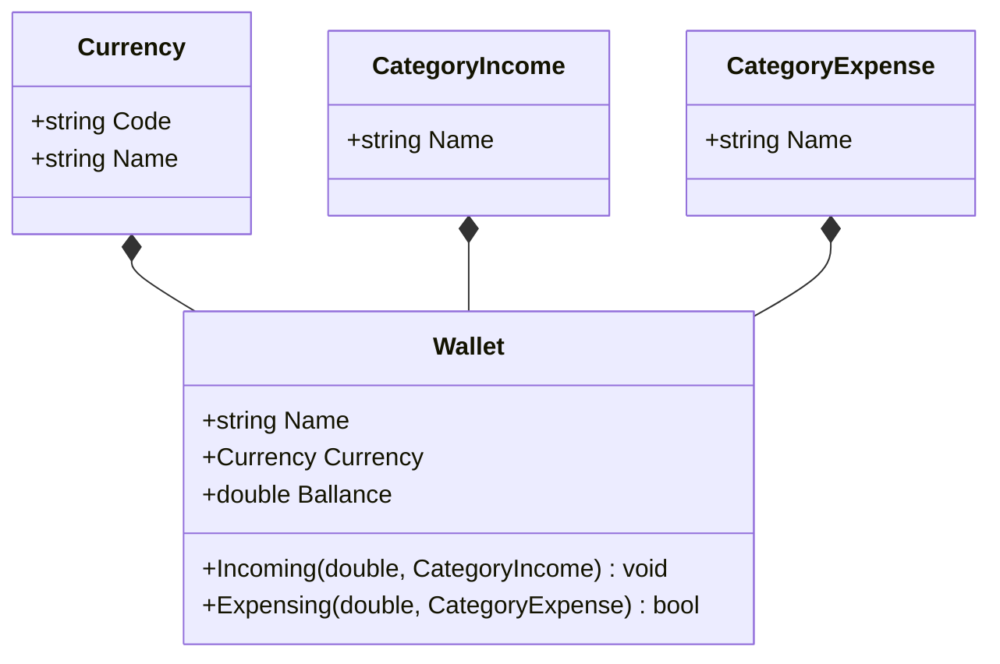

# PersonalFinanceAccounting

## Словарь названий сущностей
валюта - currency

доход - income

расход - expense

кошелёк - wallet

остаток - balance

## Ответственные за задачи

+ Создание БД (MySQL) - Михаил (проверяющий - Евгений)
+ Создание модели - Галина (проверяющий - Назар)
+ Создание DB API - Дарья (проверяющий - Евгений, Галина (?), Алексей (?))
+ Создание уровня бизнес-логики - Алексей (проверяющий - (?))
+ Создание UI - Назар (проверяющий - (?))

## Диаграмма модулей

## Диаграмма таблиц БД

## Диаграмма классов модели данных

